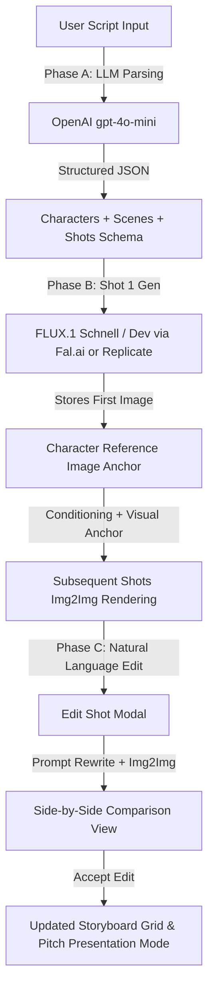

# CineCraft AI — Full-Stack AI Storyboard Generator with Character Consistency & Shot Editing

An end-to-end full-stack web application that takes screenplays or ad scripts (3–4 scenes, 3–5 shots per scene), parses them using OpenAI LLMs (`gpt-4o-mini`), synthesizes storyboard panels using **FLUX.1 [schnell] / [dev]** via Fal.ai / Replicate, enforces **Character Identity Visual Consistency** across all shots, and supports **Natural Language Editing** of individual shot panels with side-by-side comparison.

---

## 🌟 Key Features

1. **Intelligent Screenplay & Character Parsing (Phase A)**:
   - Takes raw script text (including pre-loaded iconic samples such as the **Jackie Shroff Parle-G Commercial**).
   - Calls OpenAI `gpt-4o-mini` with JSON Structured Outputs to extract:
     - **Character Visual Identity Anchors**: Detailed facial features, age, clothing, signature accessories (e.g. Jackie Shroff's vintage leather jacket, red silk neck bandana, sunglasses, salt-and-pepper hair).
     - **Scenes & Shots Breakdown**: Shot numbers, shot types (Wide, Close-Up, Medium), camera angles (Low Angle, Eye Level, Dutch Angle), physical actions, dialogue quotes, and synthesized FLUX image prompts.

2. **Character Consistency & Reference Conditioning (Phase B)**:
   - Renders the **first shot** featuring the lead character and captures its generated URL as `character_reference_image`.
   - For all subsequent shots featuring that character, prepends the `visual_anchor` description to the prompt AND feeds `character_reference_image` into **IP-Adapter / Img2Img conditioning** (denoising strength ~0.45–0.6).
   - Ensures facial identity, hair, costume, and signature accessories remain visually identical across shots.

3. **Natural Language Shot Editing (Phase C)**:
   - Inline "Edit Shot" modal for any panel.
   - Accepts plain English edit instructions (*"Change camera angle to dramatic low angle"*, *"Make it torrential rain at night with glowing neon reflections"*).
   - Uses LLM to rewrite the FLUX prompt while preserving character visual anchors.
   - Renders updated shot with **Side-by-Side Comparison View** ("Original" vs "Edited") before accepting changes.

4. **Interactive Storyboard Grid & Pitch Presentation Mode**:
   - Scene-by-scene group view with shot cards, camera angle badges, and action descriptions.
   - One-click **"Generate All Storyboard Panels"** batch processing.
   - Fullscreen **Pitch Presentation Mode** with auto-advance and keyboard shortcuts (Arrow Keys / Spacebar).
   - Storyboard export as JSON schema and printable PDF document.

---

## 🏗️ System Architecture & Workflow



---

## 🛠️ Tech Stack

- **Frontend**: Next.js 14+ (App Router), React 19, TypeScript, Tailwind CSS v4, Lucide Icons, Canvas Confetti.
- **Backend API Routes**: Next.js Serverless API Routes (`/api/parse-script`, `/api/generate-image`, `/api/edit-shot`).
- **LLM Engine**: OpenAI API (`gpt-4o-mini`) using Structured Outputs / JSON mode.
- **Image Generation Engines**:
  - **Fal.ai**: `fal-ai/flux-1/schnell`, `fal-ai/flux-1/dev`, `fal-ai/flux/dev/image-to-image`.
  - **Replicate**: `black-forest-labs/flux-schnell`, `black-forest-labs/flux-dev`.
  - **Fallback Engine**: Pollinations FLUX visual generator with seed hashing for offline / zero-config demo testing.

---

## 🚀 Getting Started & Setup

### 1. Prerequisites
- Node.js 18+ or 22+
- npm or yarn

### 2. Environment Setup
Create a `.env.local` file in the project root (or configure via the in-app **API Config** modal):

```bash
# OpenAI API Key (Required for script parsing & prompt editing)
OPENAI_API_KEY=sk-proj-your_openai_api_key_here

# Fal.ai API Key (For FLUX.1 image generation)
FAL_KEY=fal-your_fal_api_key_here

# Replicate API Token (Alternative image generation engine)
REPLICATE_API_TOKEN=r8_your_replicate_token_here

# Default Image Model Choice
DEFAULT_IMAGE_MODEL=fal-flux-schnell
```

### 3. Installation & Local Development
```bash
# Navigate into project folder
cd ai-storyboard-generator

# Install dependencies
npm install

# Run dev server
npm run dev
```

Open [http://localhost:3000](http://localhost:3000) in your browser.

---

## 🎨 Character Consistency Methodology

To solve the classic AI storyboard problem of varying character faces across different camera shots, CineCraft AI implements a two-layered consistency pipeline:

1. **Textual Visual Anchor Injection**:
   Every character profile generated by the parser contains a strict `visual_anchor` clause detailing:
   `[Character Identity: 60s legendary Bollywood actor, olive skin tone, salt-and-pepper hair, thick mustache, vintage brown leather jacket, dark aviator sunglasses around neck, signature red silk neck bandana]`.
   This clause is automatically injected into every shot prompt featuring that character.

2. **Image-to-Image / IP-Adapter Reference Conditioning**:
   The first generated shot image of the lead character is saved as `character_reference_image`. All subsequent shots pass this reference image URL into FLUX.1 img2img / reference conditioning with denoising strength ~0.5. This preserves facial geometry, clothing patterns, and color harmony across wide shots, medium shots, and close-ups.

---

## 📄 License
MIT License. Created with Next.js, OpenAI, and FLUX.1.
